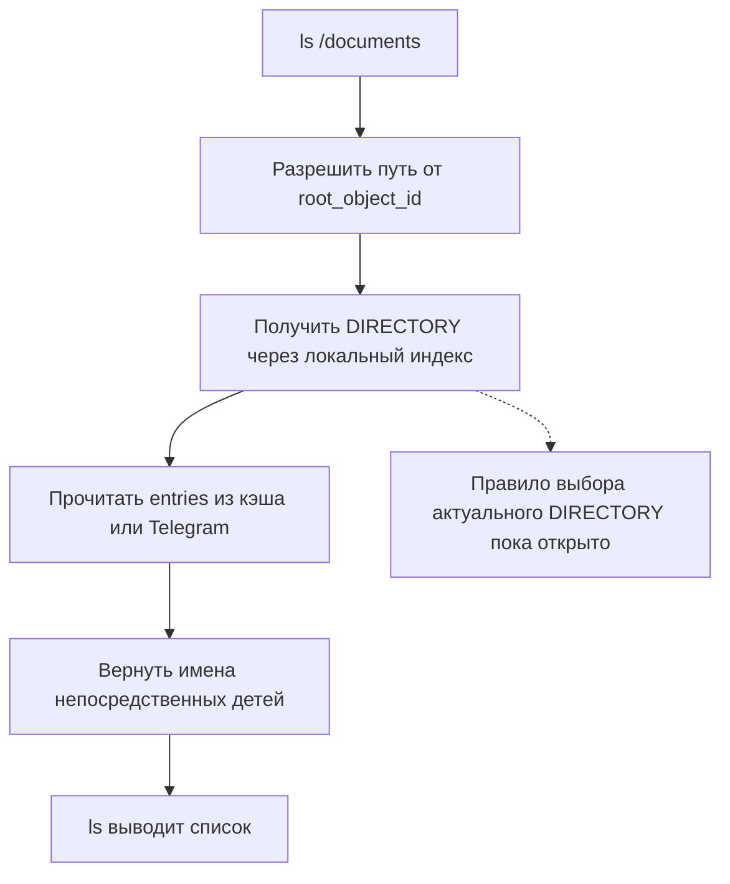
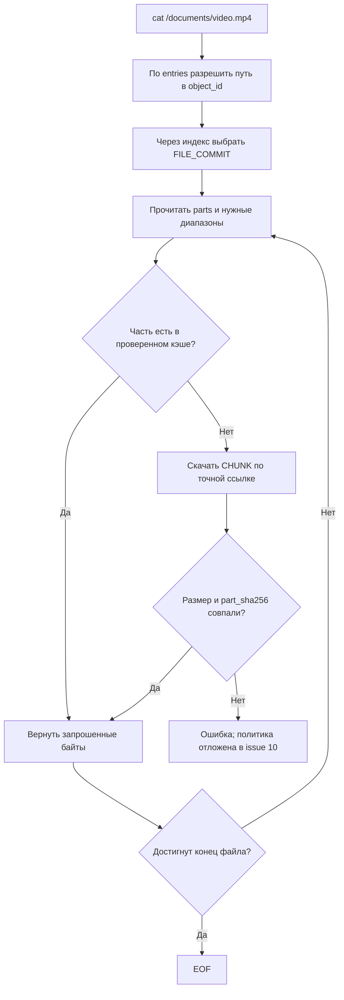

Общая идея выглядит так

```mermaid
flowchart TD
    A["ls /documents"] --> B["Разрешить путь от root_object_id"]
    B --> C["Получить DIRECTORY через локальный индекс"]
    C --> D["Прочитать entries из кэша или Telegram"]
    D --> E["Вернуть имена непосредственных детей"]
    E --> F["ls выводит список"]
    C -.-> U["Правило выбора актуального DIRECTORY пока открыто"]
```
Для получения имён скачивать части файлов не требуется.

```mermaid
flowchart TD
    A["cat /documents/video.mp4"] --> B["По entries разрешить путь в object_id"]
    B --> C["Через индекс выбрать FILE_COMMIT"]
    C --> D["Прочитать parts и нужные диапазоны"]
    D --> E{"Часть есть в проверенном кэше?"}
    E -->|Да| H["Вернуть запрошенные байты"]
    E -->|Нет| F["Скачать CHUNK по точной ссылке"]
    F --> G{"Размер и part_sha256 совпали?"}
    G -->|Да| H
    G -->|Нет| X["Ошибка; политика отложена в issue 10"]
    H --> I{"Достигнут конец файла?"}
    I -->|Нет| D
    I -->|Да| J["EOF"]
```
